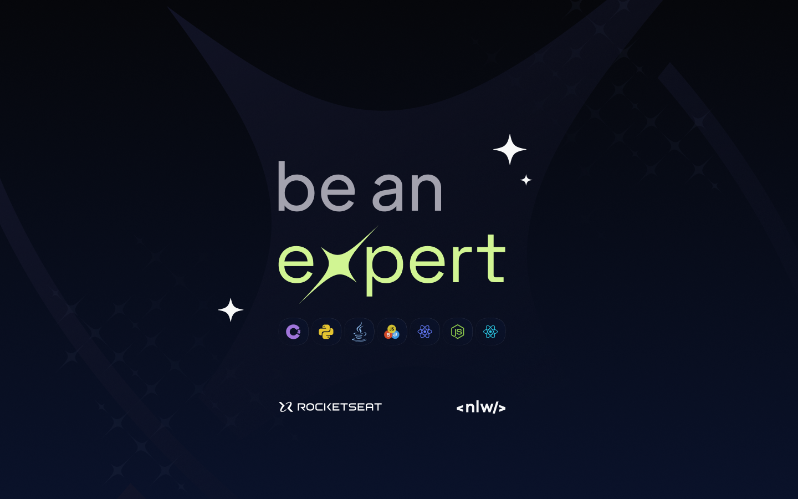
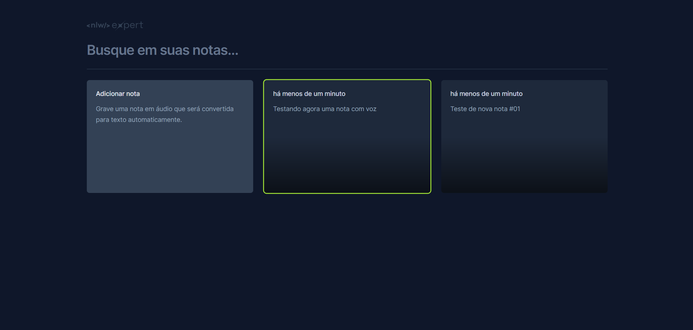

<h1 align="center">NLW Expert - Notes</h1>

  Aplicação desenvolvida em evento gratuito da <a href="https://app.rocketseat.com.br/home">Rocketseat</a>.

  <a href="#-tecnologias">Tecnologias</a>&nbsp;&nbsp;&nbsp;|&nbsp;&nbsp;&nbsp;
  <a href="#-projeto">Projeto</a>&nbsp;&nbsp;&nbsp;|&nbsp;&nbsp;&nbsp;
  <a href="#-aprendizado">Aprendizado</a>&nbsp;&nbsp;&nbsp;|&nbsp;&nbsp;&nbsp;
  <a href="#-layout">Layout</a>&nbsp;&nbsp;&nbsp;

 

 

## 🚀 Tecnologias

Esse projeto foi desenvolvido com as seguintes tecnologias:

- [HTML](https://developer.mozilla.org/pt-BR/docs/Web/HTML)
- [CSS](https://developer.mozilla.org/pt-BR/docs/Web/CSS)
- [TailwindCSS](https://tailwindcss.com/)
- [ReactJs](https://pt-br.legacy.reactjs.org/)
- [Git](https://git-scm.com/)
- [GitHub](https://github.com/)

 

## 📝  Projeto

Esta é uma aplicação desenvolvida com o intuito de praticar e aprender o uso da biblioteca ReactJs do JavaScript, juntamente com outras tecnologias como o TailwindCSS.

### ⚙️ Features

- Criação de notas
   - Entrada por teclado; ou
   - Gravação de voz.
- Armazenamento em LocalStorage; e
- Exclusão de notas;
- Filtro de busca das notas.

 

Este projeto foi desenvolvido em conjunto com as video-aulas ministradas pelo educador [Diego Fernandes](https://github.com/diego3g) e oferecidas na trilha de ReactJs durante o evento da NLW Expert, elaborado pela [Rocketseat](https://app.rocketseat.com.br/home) para promover a educação de desenvolvedores.

 

## 🧠 Aprendizado

Esta aplicação foi enriquecedora por me introduzir de uma maneira muito eficiente a biblioteca do ReactJs, esclarecendo diversas funcionalidades do JavaScript além de demonstrar como uma tecnologia pode fazer uma grande diferença no desenvolvimento de aplicações, principalmente de Front-end, além de mostrar a infinidade de possibilidades que a biblioteca disponibiliza.

 

## 📋 Layout

Você pode visualizar o layout do projeto através [DESSE LINK](https://www.figma.com/community/file/1336456128647909148/nlw-expert-notes).

 

**Nota:** É necessário ter conta no [Figma](https://figma.com) para acessá-lo.

 

---

🚀 Evento executado por Eduardo Siles 💜
